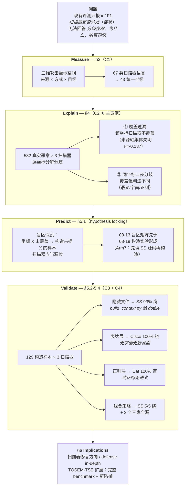
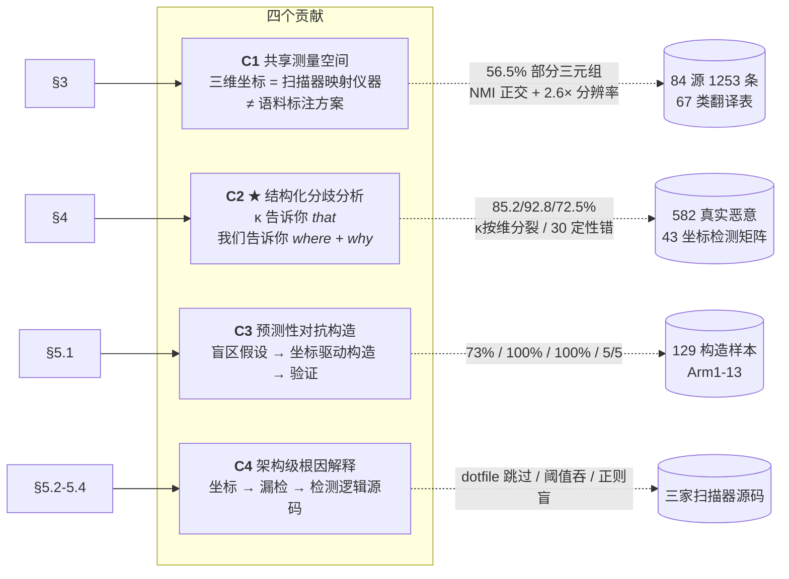
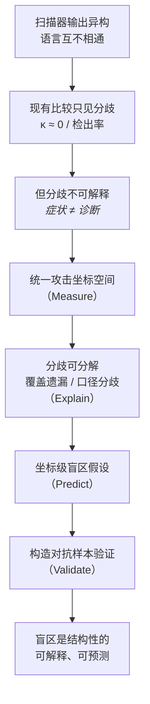

# JAWS 论文骨架图 — 脉络 + 贡献点 + 为什么非我们不可

> v1 | 2026-08-21 | 供讨论用，确认后转为正文 Fig 1

## 图 1：论文脉络（Measure → Explain → Predict → Validate）

## 图 2：贡献点 ↔ 章节 ↔ 证据

## 图 3：为什么非我们不可（能力矩阵）

| 能力 | MalSkillBench | SkillTrustBench | ClawHub | Locate-and-Judge | SkillsMetric | **我们** |
|---|---|---|---|---|---|---|
| 统一坐标空间 | ⚠️ 语料标注方案（描述自己生成了什么） | ✗ 枚举 T01-T09 | ✗ | ✗ | ✗（扫描器内部 5 维） | ✅ **扫描器输出映射空间** |
| 分歧结构化定因 | ✗ 只证"组合恢复不了" | ✗ | ⚠️ 只观测分歧不解释 | ✗ 只测召回 | ⚠️ 只测自建静态框架 | ✅ **覆盖遗漏 vs 口径分歧** |
| 坐标驱动构造 | ⚠️ GVF 流水线（随机攻击模式迁移） | ⚠️ 注入+变异（枚举式） | ✗ | ✗ | ⚠️ 对抗集但非坐标系统采样 | ✅ **沿坐标系统采样** |
| 机制根因（源码级） | ✗ | ✗ | ✗ | ✗ | ⚠️ 部分 | ✅ **dotfile/阈值/正则三根因** |
| 真实 wild 数据兜底 | ✅ 3944 | ⚠️ 95.6% 合成 | ✅ 67k | ⚠️ 65 样本 | ⚠️ 138k 扫描但构造评测 | ✅ **582 真实 + 129 构造** |

**一句话**：竞品各自占一格，没有人同时具备「坐标 + 定因 + 构造 + 机制」四层证据链。

## 图 4：叙事因果链（Introduction 用）

## 图 5：Hypothesis Locking 时间线（回应 reviewer "先知道结果再造样本？"）

| 时间 | 事件 | 性质 |
|---|---|---|
| 07-17~21 | 84 源收集 + 三维定稿 | Measure 前置 |
| **08-02** | 六家扫描器映射落库（172 条） | **Measure** |
| **08-11** | NMI / κ 按维分裂 / 覆盖轮廓 | **Explain** |
| **08-13** | 43 坐标 + 83 槽盲区矩阵 + 可行性分析 | **Predict** |
| 08-16/17 | 主实验 582（检出率 + 归因） | Validate 第一轮 |
| 08-18 | Arm1-6 | Exploratory（方法可行性） |
| **08-19** | **Arm7：先读 SS 源码 → 预测 → 构造** | **✅ hypothesis locking** |
| 08-19/20 | Arm8-13 | Confirmatory（预测验证） |

**关键**：盲区矩阵（08-13）先于构造实验（08-19）形成。Arm7 是最干净的 locking 案例（源码分析在先）。
